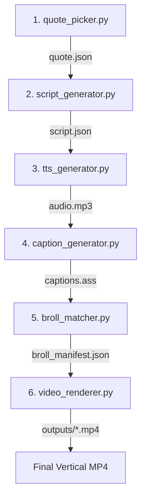

# Stoic Shorts Video Pipeline 🎥🏛️

An autonomous, end-to-end AI video creation pipeline that turns timeless Stoic quotes into engaging, vertical short-form videos (YouTube Shorts, TikTok, Instagram Reels).

Built with **Gemini 3.6 Flash Multimodal Vision**, **Edge-TTS**, **Local Whisper Transcription**, and **FFmpeg**.

---

## 🌟 Key Features & Capabilities

- **Father-Son Conversational Format**: Converts quotes into warm, authoritative father-to-son advice following strict voice bible guidelines.
- **Multimodal Vision Re-Ranking**: Probes stock video APIs for candidate thumbnails across 4 script beats (`hook`, `context`, `application`, `cta`) and uses **Gemini 3.6 Flash** to visually evaluate raw thumbnail images before selecting the winning clip.
- **Single-Word Subtitle Highlighting**: Renders vertical ASS subtitles where text defaults to clean **white**, and only the single word being spoken at that exact moment turns **yellow** (`&H0000FFFF&`).
- **Dynamic Audio Ducking & Music Layer**: Synthesizes speech with deep chest resonance filters, pads `+1.2s` of trailing post-speech silence, and ducks ambient background music during speech.
- **Rewatch Loop Prompts**: Automatically structures CTA beats ending with `"because..."` to create a seamless loop back into the opening hook (*"Son,"*).
- **Built-in Telemetry Tracking**: Monitors Gemini API token usage, downloaded clip bytes, execution time, and peak RAM consumption via `psutil`.

---

## 🏗️ Architecture & Module Flow



Each module runs standalone with file-based inputs/outputs (`JSON`, `MP3`, `ASS`), allowing independent testing before execution via `orchestrator.py`.

---

## 🚀 Getting Started

### Prerequisites
- **Python 3.10+**
- **FFmpeg** installed and on system `PATH` (or auto-detected via `imageio-ffmpeg`).

### 1. Installation
Clone the repository and install the Python dependencies:

```bash
git clone https://github.com/kacurubisonmeeme/Zhania-Agency-stoic-pipeline.git
cd Zhania-Agency-stoic-pipeline
pip install -r requirements.txt
```

### 2. Environment Configuration
Copy `.env.example` to `.env` and add your API keys:

```bash
cp .env.example .env
```

Edit `.env`:
```env
# Gemini API Key (required for script generation & vision re-ranking)
GEMINI_API_KEY=your_gemini_api_key_here

# Pexels API Key (required for stock footage downloads)
PEXELS_API_KEY=your_pexels_api_key_here

# Pixabay API Key (optional secondary source)
PIXABAY_API_KEY=your_pixabay_api_key_here
```

---

## 💻 Usage

### Run the Full Pipeline End-to-End

Run orchestrator with a random theme:
```bash
python orchestrator.py
```

Run orchestrator for a specific theme (e.g. `adversity`, `fear`, `control`, `anger`, `discipline`):
```bash
python orchestrator.py --theme adversity
```

Run a dry run without downloading clips:
```bash
python orchestrator.py --theme fear --no-download
```

### Run Standalone Modules

You can execute any individual pipeline module in isolation:

```bash
python quote_picker.py --theme adversity
python script_generator.py
python tts_generator.py
python caption_generator.py
python broll_matcher.py
python video_renderer.py
```

---

## 📁 Repository Structure

```
├── orchestrator.py         # Main entry point — runs modules 1-6 in sequence
├── quote_picker.py         # Module 1: Picks unique quote from CSV database
├── script_generator.py     # Module 2: Generates 4-beat script & visual shot list via Gemini
├── tts_generator.py        # Module 3: Synthesizes TTS & mixes ducked ambient music
├── caption_generator.py    # Module 4: Transcribes audio with Whisper & creates ASS captions
├── broll_matcher.py        # Module 5: Multimodal vision re-ranking & stock clip downloader
├── video_renderer.py       # Module 6: Trims, crops to 1080x1920, burns subtitles, muxes MP4
├── voice_bible.md          # Script generation rules & few-shot examples
├── stoic_quotes_database.csv # Database of Stoic quotes mapped by theme
├── broll_keywords.json     # Curated fallback search terms per theme
├── music/                  # Ambient background music tracks & theme mapping
├── outputs/                # Rendered final 1080x1920 MP4 videos (ignored in git)
├── requirements.txt        # Python dependency manifest
└── .env.example            # Environment variable template
```

---

## 📄 License

Distributed under the MIT License. See `LICENSE` for details.
